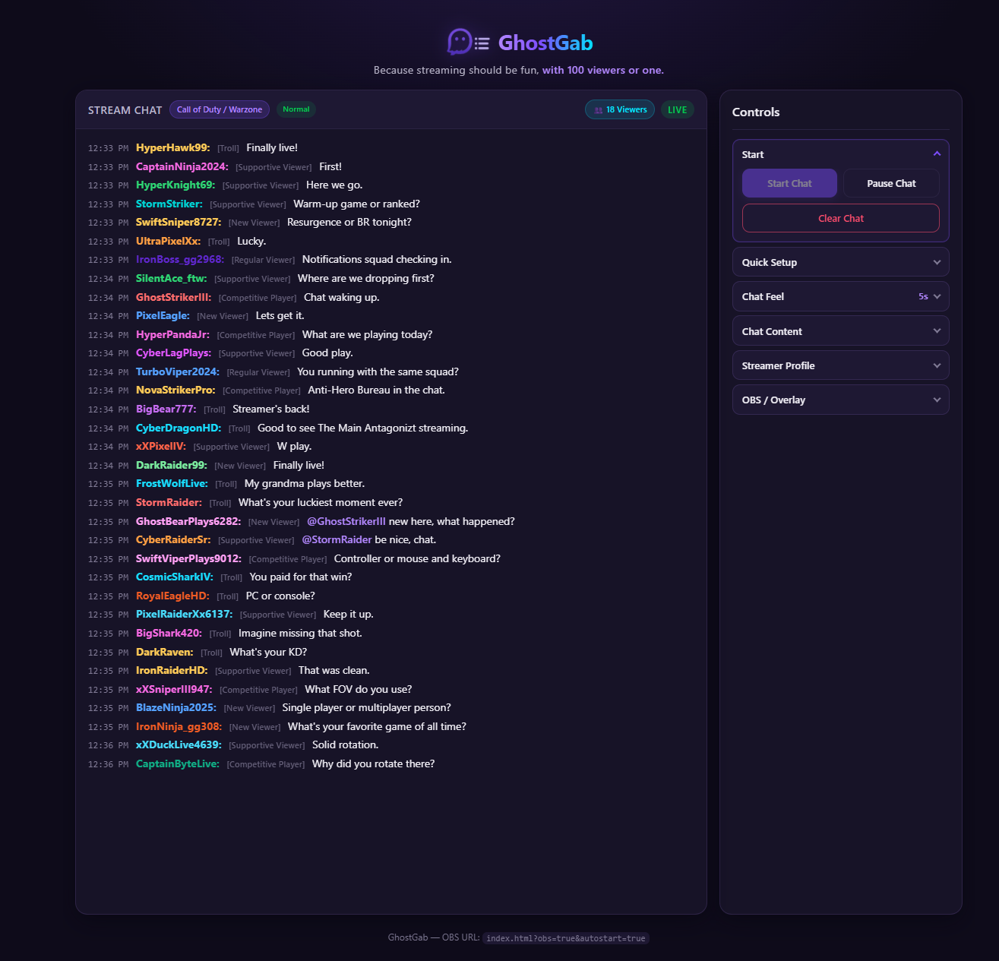
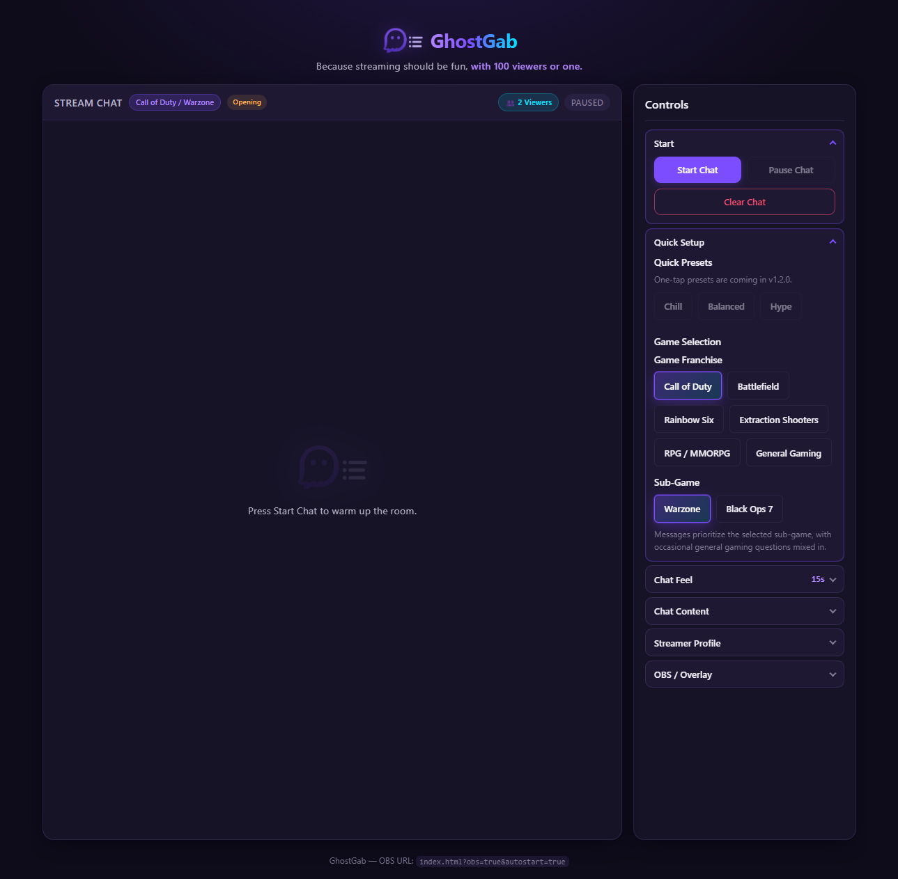
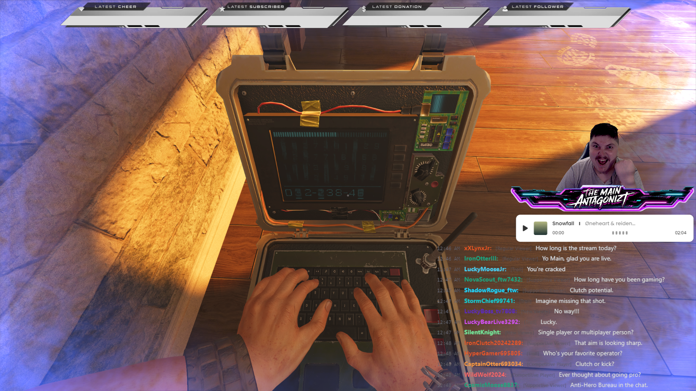

# 👻 GhostGab

### Because streaming should be fun, with 100 viewers or one.

GhostGab is a browser-based, OBS-ready practice chat overlay for beginner and small streamers.

It helps creators fill dead air, practice talking to chat, test overlays, and feel less lonely when streaming to 0–5 viewers.

## 🚀 Live Demo

https://themainanta6onizt.github.io/GhostGab/

## 📸 Screenshots

### Active Chat



### Empty Chat



### OBS Integration


### Overlay Demo



## ✨ Features

- Simulated stream chat with distinct viewer personalities
- Opening → normal stream phases with greetings
- Streamer profile so chatters can reference you by name
- Game-specific conversations
- Adjustable message frequency and viewer count simulator
- Optional chatter-to-chatter interactions
- Transparent OBS overlay mode with auto-start support

## ⚡ Quick Start

1. Open the live demo.
2. Choose a game franchise and sub-game.
3. Adjust viewer count and message frequency.
4. Press **Start Chat**.
5. Enable **OBS Mode** for a clean overlay.

## 🎥 OBS Browser Source

Add a Browser Source pointing at:

```text
https://themainanta6onizt.github.io/GhostGab/?obs=true&autostart=true
