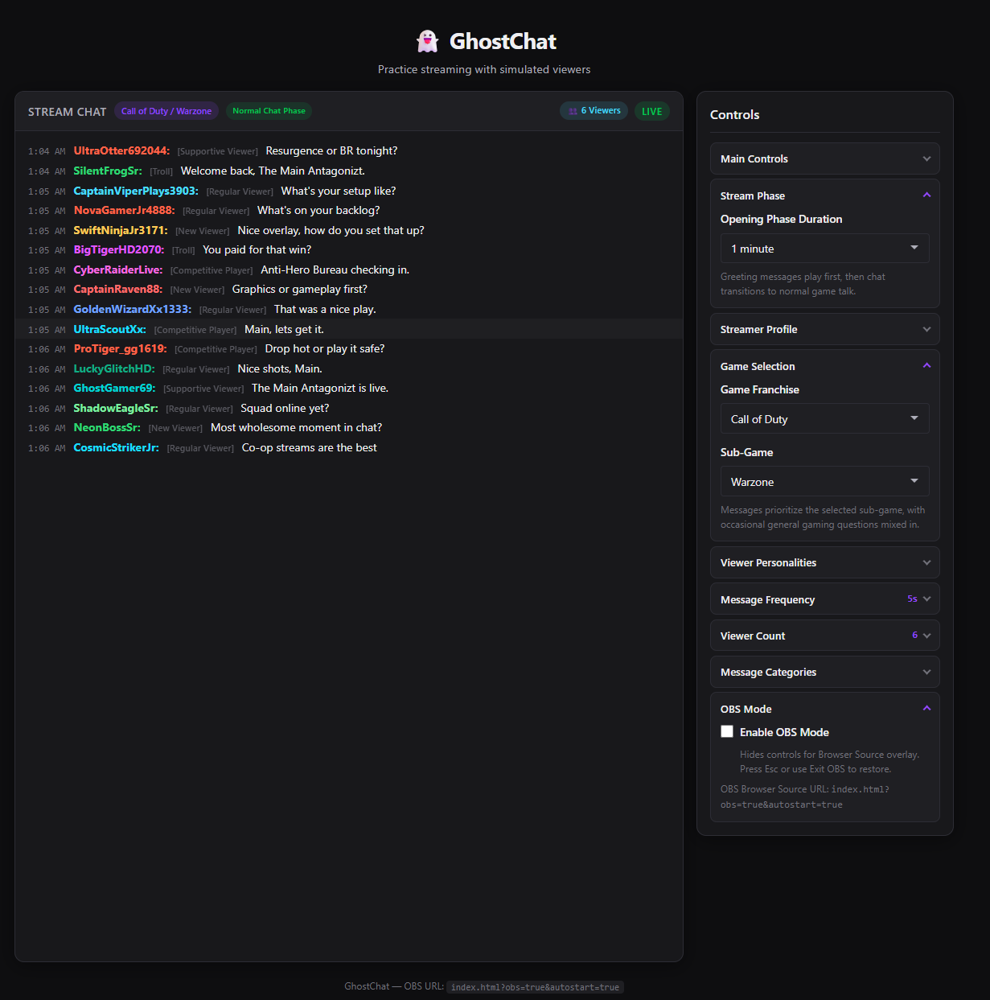
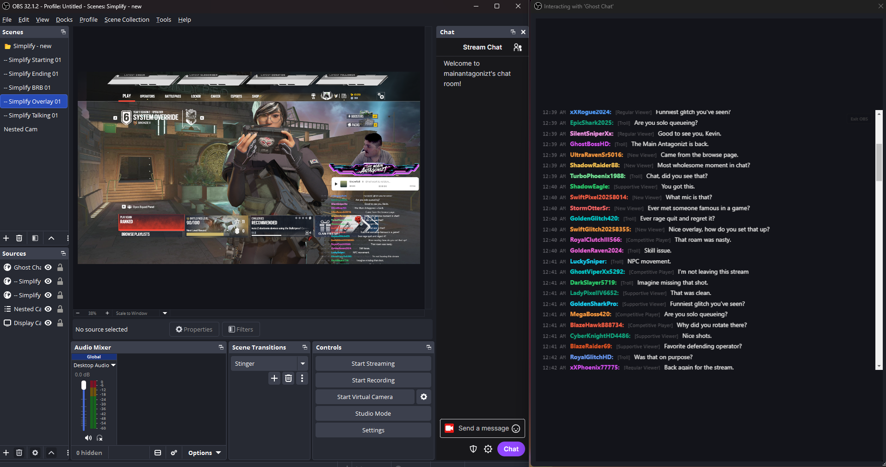

# 👻 GhostChat

### Because streaming should be fun, with 100 viewers or one.

GhostChat is a browser-based Twitch-style chat simulator designed for streamers, podcasters, and content creators who want to practice interacting with a live audience.

Whether you're streaming to 0 viewers or preparing for your next big stream, GhostChat helps keep the conversation flowing by simulating realistic chat messages, questions, reactions, and community engagement.

## 🚀 Live Demo

https://themainanta6onizt.github.io/GhostChat/

## Screenshots

### Control Panel

### OBS Integration

### Overlay Demo

## ✨ Features

- Simulated live viewers
- Viewer personalities
- Stream phases (Opening, Active, etc.)
- Game-specific conversations
- Streamer profile customization
- Viewer count simulator
- Adjustable message frequency
- OBS browser source support
- Transparent overlay mode
- Multiple game categories

## Quick Start

1. Visit the live demo:
   https://themainanta6onizt.github.io/GhostChat/

2. Select a game franchise and sub-game.

3. Choose your viewer count and message frequency.

4. Press **Start Chat**.

5. Enable **OBS Mode** if you want to use GhostChat as a Browser Source overlay.

6. Add the OBS URL to a Browser Source and start practicing.

## OBS Browser Source Setup

1. Open GhostChat.
2. Configure your settings.
3. Enable OBS Mode.
4. Copy the generated OBS URL.
5. Add a Browser Source in OBS Studio.
6. Paste the URL.
7. Resize and position the chat overlay.

## 🎮 Supported Games

- Call of Duty: Warzone
- Black Ops 7
- Battlefield 6
- Redacted Sector (RedSec)
- Rainbow Six Siege
- Diablo IV
- Escape from Tarkov
- World of Warcraft
- ARC Raiders

## 📺 OBS Support

GhostChat can be added as an OBS Browser Source for use as a simulated live chat overlay.

Example URL:

https://themainanta6onizt.github.io/GhostChat/

## 🛠 Built With

- HTML
- CSS
- JavaScript
- Cursor AI

## 📌 Roadmap

Future ideas:

- Readable Monitor Mode
- Real Twitch chat integration
- AI-generated chat personalities
- Stream analytics
- Additional game support
- Community-created chat packs

## 📄 License

MIT License
